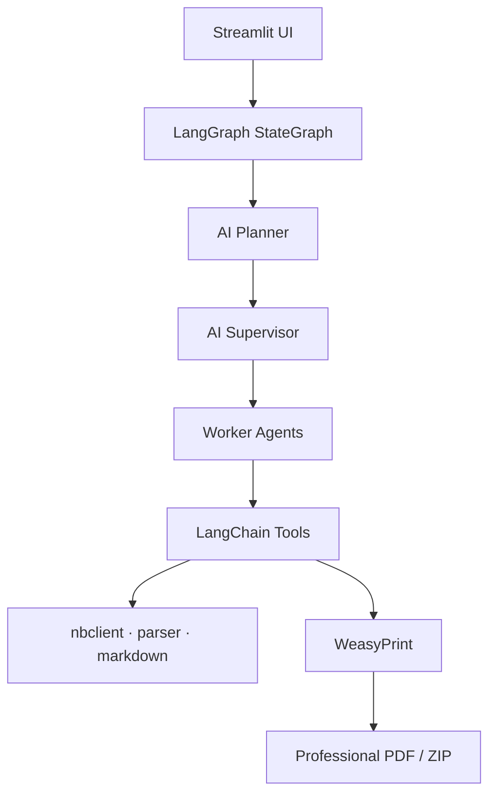

# Notebook2PDF AI

<p align="center">
  <strong>AI-Native LangGraph Orchestration with Deterministic Tools</strong><br/>
  Convert Jupyter notebooks into publication-ready PDF documents
</p>

<p align="center">
  <a href="https://github.com/junaidmalikai/jupyter2pdf"></a>
  <a href="#langgraph-architecture"></a>
  <a href="https://python.langchain.com/"></a>
</p>

<p align="center">
  <a href="#ai-workflow"></a>
  <a href="https://weasyprint.org/"></a>
  <a href="https://streamlit.io/"></a>
  <a href="https://www.python.org/"></a>
  <a href="https://github.com/junaidmalikai/jupyter2pdf/blob/master/LICENSE"></a>
</p>

<p align="center">
  <a href="#live-demo">Live Demo</a> ·
  <a href="#sample-pdf">Sample PDF</a> ·
  <a href="#installation">Installation</a> ·
  <a href="#quick-start">Quick Start</a> ·
  <a href="#contributing">Contributing</a>
</p>

---

## Project Overview

**Notebook2PDF AI** is an AI-native multi-agent platform that converts Jupyter notebooks (`.ipynb`) into professional, publication-ready PDF documents.

It uses **AI-Native LangGraph Orchestration with Deterministic Tools**:

- **LangGraph** coordinates a planner, supervisor, and specialized worker agents
- **LangChain** StructuredTools perform deterministic work (parsing, execution, packaging)
- **WeasyPrint** renders the final PDF layout — PDF rendering itself is **not** AI-generated

AI agents analyze, validate, enrich, and coordinate the conversion workflow. Deterministic tools ensure accurate notebook execution and high-quality document output.

Built for portfolios, technical reports, research handoffs, and reproducible notebook documentation.

---

## Key Features

| Feature | Description |
|---------|-------------|
| AI-native orchestration | Single LangGraph StateGraph drives the conversion |
| Multi-agent workflow | Planner, supervisor, and tool-calling workers |
| Notebook analysis | Structure and execution-readiness inspection |
| AI planning & supervision | Ordered plans and dynamic next-agent routing |
| Notebook execution | Optional `nbclient` / IPython kernel runs |
| Enrichment | Markdown review, metadata, code understanding, images |
| Documentation | README / documentation generation via LCEL + tools |
| Validation & quality | Checks, scoring, repair loops, final approval |
| Professional PDFs | Cover, headers/footers, branding, watermark, rich outputs |
| Packaging | Single PDF, or ZIP for multi-notebook batches |
| Streamlit UI | Provider validation, PDF settings, upload, live pipeline log |
| Observability | Optional LangSmith tracing |

<details>
<summary><strong>Supported notebook content</strong></summary>

<br/>

Markdown · headings · lists · tables · images · code cells · Pygments highlighting · stdout/stderr · tracebacks · HTML/DataFrame tables · Matplotlib PNG/JPEG/SVG · Plotly static frames (when present) · execution counts · notebook metadata

</details>

<details>
<summary><strong>PDF document features</strong></summary>

<br/>

Cover page · branded header/footer · configurable title/author/company/version · optional watermark · page numbers · syntax-highlighted code · output containers · professional tables · page breaks

</details>

---

## Architecture Overview



```text
Streamlit
    ↓
LangGraph
    ↓
Planner
    ↓
Supervisor
    ↓
Workers
    ↓
LangChain Tools
    ↓
nbclient
    ↓
WeasyPrint
    ↓
Professional PDF
```

---

## LangGraph Architecture

The conversion engine is a compiled LangGraph `StateGraph`:

1. **validation_bootstrap** — verify provider credentials  
2. **planner** — AI plan with ordered worker steps  
3. **supervisor** — AI routing to the next worker (including parallel enrichment via `Send`)  
4. **workers** — tool-calling agents for analysis, execution, enrichment, docs, validation, quality, PDF, packaging  
5. **finish / error_node** — terminal outcomes  

Parallel enrichment workers rejoin through `enrichment_merge`, then return to the supervisor.

---

## AI Workflow

| Agent | Role |
|-------|------|
| `notebook_analysis` | Inspect notebook structure and execution needs |
| `notebook_execution` | Execute code cells when required |
| `code_understanding` | Summarize techniques, libraries, and risks |
| `markdown` | Review markdown narrative quality |
| `metadata` | Enrich title, description, keywords, language |
| `documentation` | Generate README / documentation artifacts |
| `image_processing` | Inventory image outputs |
| `validation` | Blocking checks before PDF assembly |
| `quality_review` | Score, repair routing, final approval |
| `pdf_assembly` | HTML assembly + WeasyPrint render |
| `packaging` | Build PDF or ZIP download payload |
| `coordinator` | Cross-step coordination |

---

## Technology Stack

| Layer | Technology |
|-------|------------|
| UI | [Streamlit](https://streamlit.io/) |
| Orchestration | [LangGraph](https://langchain-ai.github.io/langgraph/) |
| Agents & tools | [LangChain](https://python.langchain.com/) StructuredTools + LCEL |
| Notebooks | `nbformat` · `nbclient` · `ipykernel` · `jupyter_client` |
| Markdown | Python-Markdown · Pygments |
| PDF | [WeasyPrint](https://weasyprint.org/) (primary) · xhtml2pdf · ReportLab (fallbacks) |
| LLM providers | OpenAI · Groq · Google Gemini · Anthropic Claude |
| Config | `python-dotenv` · Streamlit Secrets |

### Providers

| Provider | Example models |
|----------|----------------|
| OpenAI | `gpt-4.1`, `gpt-4.1-mini`, `gpt-4o`, `gpt-4o-mini`, `o3`, `o4-mini` |
| Groq | `llama-3.3-70b-versatile`, `llama-3.1-8b-instant`, `deepseek-r1-distill-llama-70b` |
| Google Gemini | `gemini-2.5-pro`, `gemini-2.5-flash`, `gemini-2.0-flash` |
| Anthropic Claude | `claude-opus-4`, `claude-sonnet-4`, `claude-3.7-sonnet` |

API keys are validated with each provider’s official SDK.

---

## Live Demo

Deploy on [Streamlit Community Cloud](https://share.streamlit.io) with main file `app.py`.

> Add your public app URL here after deployment:  
> `https://share.streamlit.io/...`

Secrets should include your provider API key(s). System packages for WeasyPrint come from [`packages.txt`](packages.txt).

---

## Sample PDF

Download a sample conversion artifact:

**[📄 Download Sample PDF](samples/Sample%20PDF.pdf)**

Or open it from the Streamlit home page with **Download Sample PDF**.

---

## Installation

```bash
git clone https://github.com/junaidmalikai/jupyter2pdf.git
cd jupyter2pdf

python -m venv .venv
# Windows
.venv\Scripts\activate
# macOS / Linux
source .venv/bin/activate

pip install -r requirements.txt
# or: uv sync
```

### Requirements

- Python **3.11 – 3.13**
- One LLM provider API key
- WeasyPrint system dependencies ([docs](https://doc.courtbouillon.org/weasyprint/stable/first_steps.html); Cloud uses `packages.txt`)

### Environment (optional)

```bash
cp .env.example .env
```

```bash
OPENAI_API_KEY=
GROQ_API_KEY=
GOOGLE_API_KEY=
ANTHROPIC_API_KEY=

J2P_LOG_LEVEL=INFO
J2P_AUTO_EXECUTE=1
J2P_EXECUTION_TIMEOUT=60
J2P_QUALITY_THRESHOLD=72
J2P_MAX_REPAIR_LOOPS=2
```

---

## Quick Start

```bash
streamlit run app.py
# or
python main.py
```

Open **http://localhost:8501**.

---

## Usage

1. Connect an LLM provider in the sidebar and paste a valid API key  
2. Configure **PDF Settings**  
3. Optionally download the **Sample PDF** from the home page  
4. Upload one or more `.ipynb` notebooks  
5. Click **Generate PDF**  
6. Follow the LangGraph pipeline log  
7. Download the resulting **PDF** or **ZIP**

---

## Project Structure

```text
jupyter2pdf/
├── app.py                 # Streamlit UI
├── main.py                # CLI → streamlit run
├── requirements.txt
├── packages.txt
├── pyproject.toml
├── .env.example
├── assets/
├── samples/
│   └── LangChain_Tool_Docstrings.pdf
├── config/                # Branding + provider catalog
├── models/                # PDF settings models
├── ui/                    # Sidebar, settings panel, CSS
├── utils/                 # Logging + secret sanitization
├── scripts/               # Audit / smoke helpers
└── services/
    ├── agent.py           # UI → graph entry
    ├── ai/                # Provider adapters
    ├── agents/            # Planner, supervisor, workers, prompts
    ├── graph/             # LangGraph workflow + LCEL chains
    ├── langchain_tools/   # Tool registry + helpers
    ├── memory/            # Checkpointer + agent memory
    ├── notebook/          # Parser, analyzer, executor
    ├── markdown/          # GFM renderer
    └── pdf/               # WeasyPrint engine + cover/styles
```

---

## Known Limitations

- Interactive Plotly widgets need a pre-rendered static image for reliable PDF embedding  
- External webfonts may differ across PDF engines  
- Uploads larger than ~50 MB are rejected by default  
- Model availability depends on provider account entitlements  

---

## Roadmap

- [ ] Public hosted demo link  
- [ ] Plotly → PNG via Kaleido when available  
- [ ] Custom brand kit upload  
- [ ] Batch folder conversion  
- [ ] PDF/A archival mode  
- [ ] Expanded test suite + CI  

---

## Contributing

Contributions are welcome.

1. Fork [junaidmalikai/jupyter2pdf](https://github.com/junaidmalikai/jupyter2pdf)  
2. Create a focused branch  
3. Preserve Streamlit UX and PDF rendering unless the change is intentional  
4. Never commit secrets  
5. Open a pull request with a clear summary  

Local checks:

```bash
python scripts/audit_ai_native.py
python scripts/smoke_test.py
```

Issues: [github.com/junaidmalikai/jupyter2pdf/issues](https://github.com/junaidmalikai/jupyter2pdf/issues)

---

## Acknowledgements

- [LangGraph](https://langchain-ai.github.io/langgraph/) — multi-agent orchestration  
- [LangChain](https://python.langchain.com/) — tools, LCEL, and model integrations  
- [Streamlit](https://streamlit.io/) — application UI  
- [WeasyPrint](https://weasyprint.org/) — HTML/CSS → PDF  
- [Project Jupyter](https://jupyter.org/) — notebook format and execution ecosystem  

---

## License

MIT — see [LICENSE](LICENSE).

---

## Author

**Junaid Malik** · [junaidmalikai](https://github.com/junaidmalikai)

- Repository: [github.com/junaidmalikai/notebook2pdf](https://github.com/junaidmalikai/notebook2pdf-ai)  
- Issues: [github.com/junaidmalikai/notebook2pdf/issues](https://github.com/junaidmalikai/notebook2pdf-ai/issues)

---

<div align="center">

**Notebook2PDF AI**

AI-Native LangGraph Orchestration with Deterministic Tools

[GitHub](https://github.com/junaidmalikai/notebook2pdf-ai) · MIT License · © 2026

</div>
